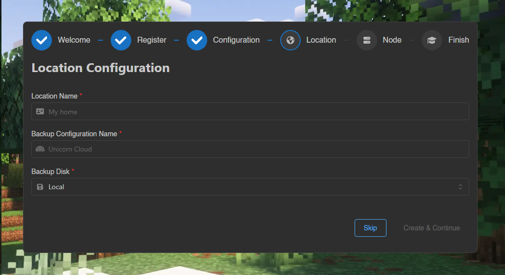
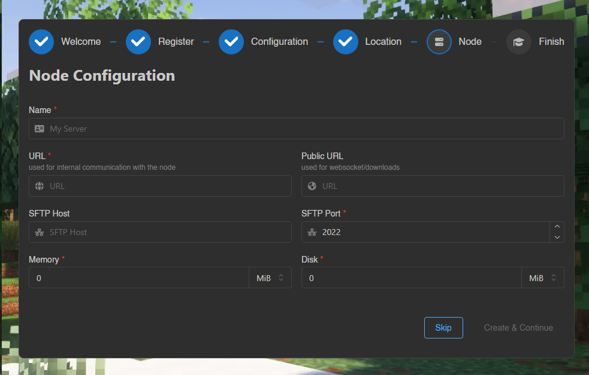
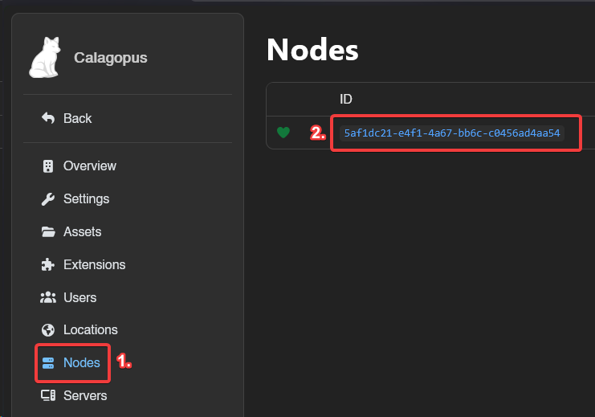
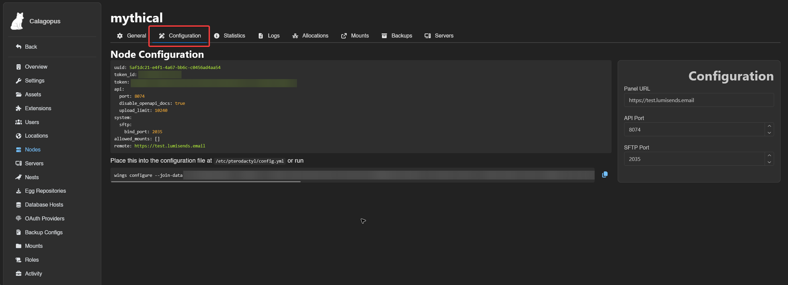
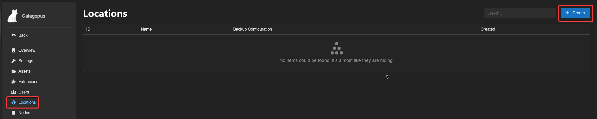
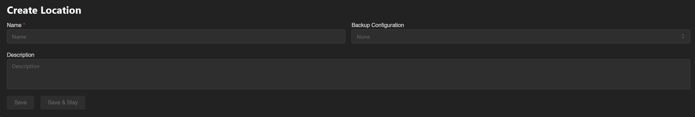
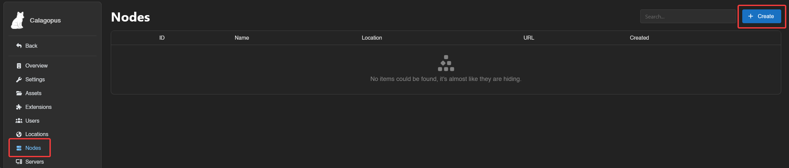
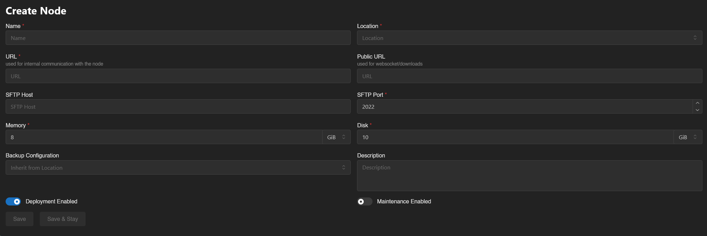

# Creating a New Node

Adding a node to Calagopus is the same way you would add a node in Pterodactyl. This can be done in both the OOBE and in the admin panel.

## Via the OOBE
### In the OOBE
During the OOBE, you will be asked to create a location. This is required to create a node.
The following fields are required to create a location:
* **Location Name**: This is the location name used to distinguish this location from others. This can be whatever you want, for this example I'm gonna make a `Germany` location.
* **Backup Configuration Name**: This is the name of your backup storage configuration, incase you have multiple backup methods for your nodes, this helps distinguish it from others.
* **Backup Disk**: This is where your backups are gonna be stored. Depending of your node, select the backup method that's more adapted to your setup. If you don't know what this is, leave it as `Local`.

Once you're done, click on the `Create & Continue` button.

Then, fill out theses values:
* **Name**: A quick identifiable name for the node.
* **URL**: The URL where the panel will access the node. For example, if your node URL is `node.calagopus.com` and your port is `8000` using HTTPS, you would enter: `https://node.calagopus.com:8000`.
* **Public URL**: Same as above, but it's the URL that's gonna be requested via the browser, this is useful if your URL above is on an internal IP.
* **SFTP Host**: Useful if your URL is an internal IP, this allows you to set a custom SFTP host to put on the dashboard, leave this empty to use the hostname of the URL.
* **SFTP Port**: Don't change this value if you don't know what are doing, this allows you to set the SFTP port for the SSH/SFTP server.
* **Memory**: The total amount of RAM the node can allocate, this value should be 90% of your total RAM, leaving 10% for your OS.
* **Disk**: The total amount of disk space the node can allocate.

Once you're done, click on the `Create & Continue` button.

Continue progressing to the OOBE until you reach to the main dashboard.

### Install Calagopus Wings
At this point in the guide, you will need to install Calagopus Wings on your node. You can install it [here](../../wings/installation.md).

### Configuring the node
Head to the admin panel, click on Nodes and then click on the node you recently created.

Then, head to the Configuration tab, copy the auto deploy command below, and then continue following the Wings install proccess via [Binary](../../wings/installation/binary.md#configure-wings) or [Package Manager](../../wings/installation/pkgmanager.md).

## Via the admin panel
### In the admin panel
This guide assumes you have created a location, if you haven't open this dropdown below:
::: details How do you create a location?
Head to the admin panel, go to the Locations tab, and create a new location.

Then, fill out theses values:
* **Location Name**: This is the location name used to distinguish this location from others. This can be whatever you want, for this example I'm gonna make a `Germany` location.
* **Backup Configuration Name**: This is the name of your backup storage configuration, incase you have multiple backup methods for your nodes, this helps distinguish it from others.
* **Description**: This is a long description used to identify your location.

Once you're done, click on the `Save` button.
:::

Head to the admin panel, go to the Nodes tab, and create a new node.

Then, fill out theses fields:
* **Name**: A quick identifiable name for the node.
* **Location**: The location you want the node in.
* **URL**: The URL where the panel will access the node. For example, if your node URL is `node.calagopus.com` and your port is `8000` using HTTPS, you would enter: `https://node.calagopus.com:8000`.
* **Public URL**: Same as above, but it's the URL that's gonna be requested via the browser, this is useful if your URL above is on an internal IP.
* **SFTP Host**: Useful if your URL is an internal IP, this allows you to set a custom SFTP host to put on the dashboard, leave this empty to use the hostname of the URL.
* **SFTP Port**: Don't change this value if you don't know what are doing, this allows you to set the SFTP port for the SSH/SFTP server.
* **Memory**: The total amount of RAM the node can allocate, this value should be 90% of your total RAM, leaving 10% for your OS.
* **Disk**: The total amount of disk space the node can allocate.
* **Backup Configuration**: If you have made one, this is where your backups are gonna be stored. Depending of your node, select the backup method that's more adapted to your setup.
* **Description**: This is a long description that is used to identify the node.
* **Deployment Enabled**: Allow deployment to this node. If this is disabled, you won't be able to create servers from the panel.
* **Maintenance Enabled**: If this is enabled, allows you to block non-admins from accessing the node. 

Once you're done, click on the `Save` button.

### Install Calagopus Wings
At this point in the guide, you will need to install Calagopus Wings on your node. You can install it [here](../../wings/installation.md).

### Configuring the node
Head to the admin panel, click on Nodes and then click on the node you recently created.

Then, head to the Configuration tab, copy the auto deploy command below, and then continue following the Wings install proccess via [Binary](../../wings/installation/binary.md#configure-wings) or [Package Manager](../../wings/installation/pkgmanager.md).
