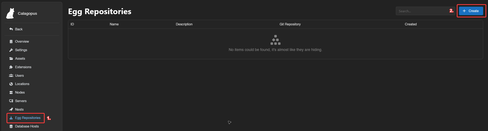
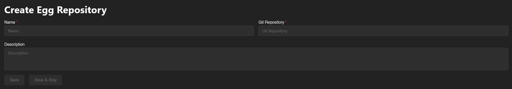
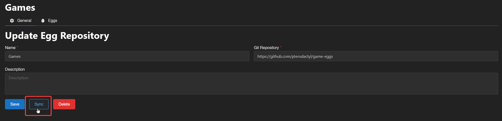
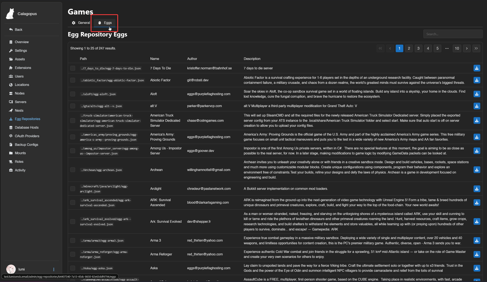
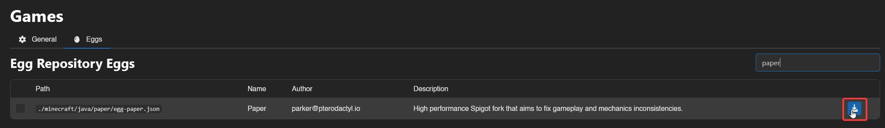
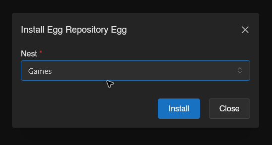

# Adding egg repositories
Egg repositories is like the Blueprint extension [Eggify](https://builtbybit.com/resources/eggify-mass-egg-importer-updater.52525/), but integrated into Calagopus Panel. It allows you to install eggs from a Git repository by scraping all the available eggs and making them available in a page for you to download.

## How do egg repositories work?
An egg repository works by storing lots of eggs on a Git repository. They are often organized by seperating games, softwares, programming languages, etc. into their own Git repository.

## But do they work with regular Pterodactyl eggs?
Yes! Calagopus has backwards compability for Pterodactyl eggs, making migration easier. This guide will use Pterodactyl's 3 egg repositories:
* [Their games repo](https://github.com/pterodactyl/game-eggs)
* [Their applications repo](https://github.com/pterodactyl/application-eggs)
* [Their generic (programming languages) repo](https://github.com/pterodactyl/generic-eggs)

## Prerequisites
To setup egg repositories, all you need is Calagopus Panel setup that is fully functional. You will also need a nest to store your eggs.

## Adding a egg repository
For this guide, we will be adding the [Pterodactyl's games repository](https://github.com/pterodactyl/game-eggs), although you can also use any egg repository you want.

First, head over to the admin panel, click on Egg Repositories on the sidebar, and then click on the Create button.

Then, fill out theses fields:
* **Name**: This is the name used to distinguish this egg repository from others. This can be whatever you want.
* **Git Repository**: This is the Git repository that the eggs are stored. This can be a GitHub repository, or any Git source such as GitLab. For this guide, I'm using Pterodactyl's games repository, so I will put `https://github.com/pterodactyl/game-eggs` in this field.
* **Description**: This is a long description that is used to identify the egg repository.

Once you're done, click on the `Save` button. Then, click on the `Sync` button to start syncing the eggs to the panel.

::: warning
This will not add the eggs directly to the panel, it will only put the full list of eggs on the Eggs tab, which then you have to import them to the egg.
:::

You should now see a little green callout saying that the egg repository is synchronised.

## Importing the eggs
::: warning
It is currently not possible to import all eggs at once. This may be implemented into a later version of Calagopus.
:::

Click on the Eggs tab, and you should be redirected to a page like this:

Here, it's up to you to decide which egg(s) would you like! If you would like documentation for what egg does what, head to the same directory as the egg in the Git repository.

On the egg you would like to import, click on the little import icon on the right of the egg like shown:

You should now be brought to a popup to select which nest would you like to import the egg to. Select the egg and click on the `Install` button.

And you're done! You can now create a server with the egg(s) you imported! If you want to import multiple eggs, just select them, and then click on the Install button below.